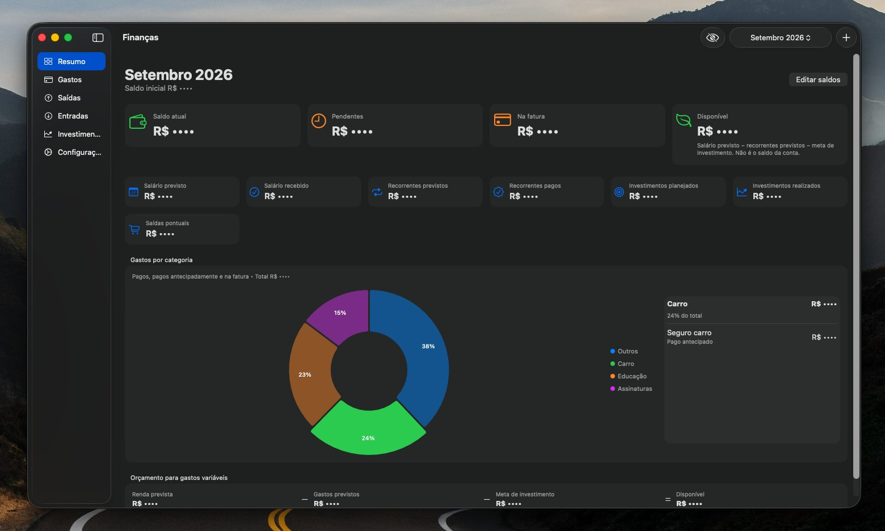

# macos-budget

A personal macOS app for monthly budgeting. Everything stays on your Mac: no accounts, no server, and no sync.



You track months, income, recurring bills, one-off purchases, and investments. **Gastos** is for recurring expenses. **Saídas** is for purchases and other one-off payments. Active recurrences are copied into each new month.

Paying the card bill only moves items from **Na fatura** to **Pago**. It does not create a second expense.

The current balance starts from the amount you enter and updates as money actually moves: received income and investment withdrawals increase it; paid expenses and investment contributions decrease it. Pending items and charges still on the invoice do not touch the account until they are paid.

Card recurrences with a due day move to **Na fatura** automatically when that day arrives (when you open the app). PIX, debit, and automatic debit stay pending until you mark them paid.

The summary shows current balance, pending charges, the invoice, expected salary, and the next salary with its countdown. The Investments screen tracks each fund and monthly contributions or withdrawals. The Occam Liquidez balance is treated as the emergency reserve and shown in months of the selected month's fixed expenses.

Use the eye button in the toolbar, or **⌘⇧H**, to hide amounts.

## Requirements

- macOS 14 or later
- Xcode 16 or later

## Run

From the project root:

```bash
swift run Financas
```

Or open `Package.swift` in Xcode, select the **Financas** scheme, and press **⌘R**.

## Data

The SQLite database lives at:

```text
~/Library/Application Support/Financas/financas.sqlite
```

On first launch the app creates the schema, default categories, and the initial investment fund balances configured for this personal installation. It does not seed months or cash transactions. In **Configurações** you can reveal the file in Finder, export a copy, or import a backup.

The local database and any `.sqlite` backups are gitignored.

## Build

Release binary:

```bash
swift build -c release
```

The executable is at `.build/release/Financas`. To wrap it as a local `.app` in `dist/`:

```bash
./scripts/build-app.sh
```

That bundle is ad-hoc signed for local use. Shipping it to other Macs needs proper signing and notarization.
